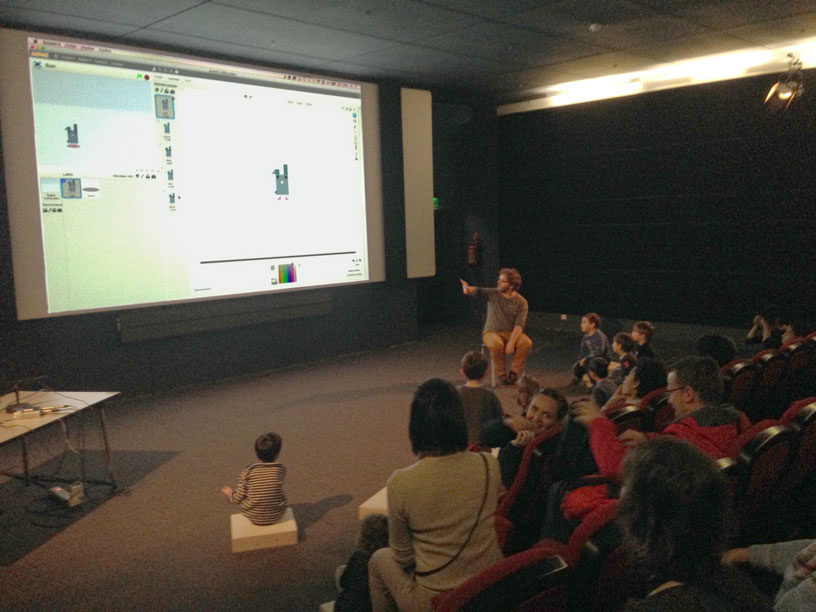
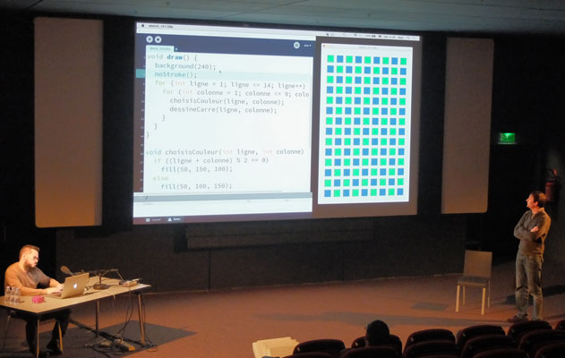

# Les Spectacles de Code
Programmer, c’est un vrai spectacle quand on le fait tous ensemble !

Un duo de performers du code créent en direct :

 - un jeu vidéo différent à chaque séance, en collaboration avec la salle. Les enfants (et les parents ;-) dirigent la création, et testent même le jeu au fur et à mesure qu’il se fabrique devant leurs yeux, grâce aux manettes sans-fils qui circulent dans la salle. 

ou

 - un tableau génératif inspiré par l'art cinétique et mathématique. Il commence simplement, puis ligne par ligne, selon les envies de la salle, il devient de plus en plus complexe et riche en formes.

Les Spectacles de Code ont été créés par Jonathan Perret et Raphaël Pierquin. 
Lors de la Fête du Code Créatif au Centre Pompidou, ils ont été joués par Jonathan Perret, Raphael Pierquin et Étienne Charignon, Emmanuel Gaillot – à l'invitation de Odile Fayet (chef de projet Centre Pompidou) et de Julien Dorra.